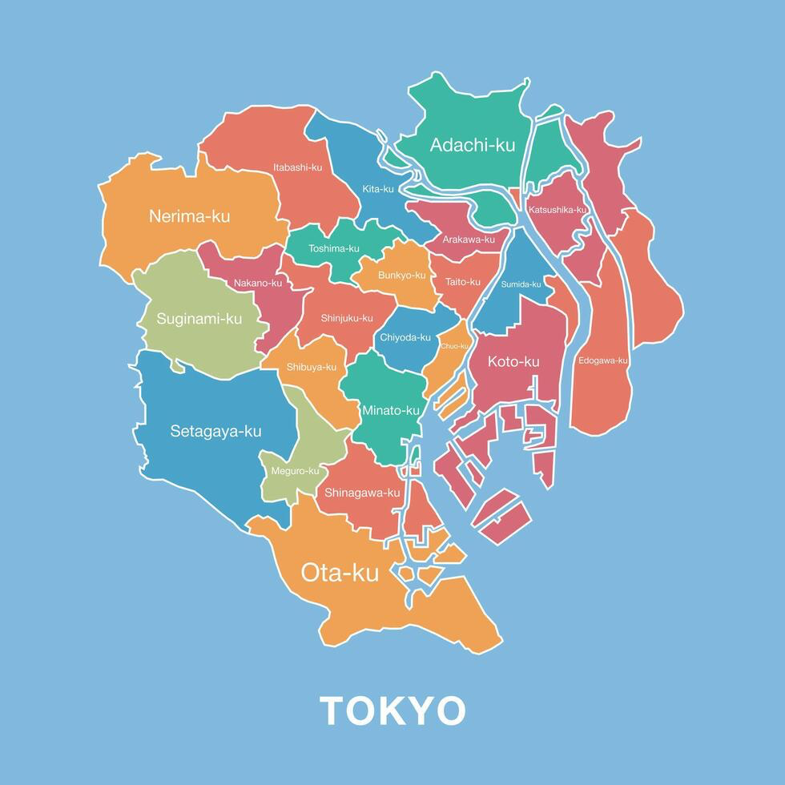

# Trip Neighborhoods

Trip neighborhood files in `Travel/<Trip>/Neighborhoods/entries/` use the `neighborhood-option` tag. The Neighborhoods folder is the **geographic backbone** of the trip — every `dining-option`, `experience-option`, `shopping-option`, and `accommodation-option` entry's `neighborhood:` frontmatter field wikilinks into this folder.

## Tokyo wards reference



The 23 special wards (-ku) are the ward-scale containers — too broad to use as `neighborhood:` values per the granularity rule below. A neighborhood file lives *inside* a ward (e.g. Aoyama is in Minato-ku, Yanesen spans Taito-ku and Bunkyo-ku). Use this map to orient when placing a new neighborhood and to spot which ward a sub-area folds into.

Same folder shape as the other category subfolders:

```
<Trip>/Neighborhoods/
├── Neighborhoods.md         ← hub (read first)
├── Neighborhoods.base       ← Bases view across entries
└── entries/                 ← one file per neighborhood
```

## Frontmatter

```yaml
created: YYYY-MM-DD
tags: [travel, <trip-tag>, neighborhood-option]
neighborhood: ""             # plain string here, not a wikilink (this IS the neighborhood)
name_jp: ""                  # native script for non-English destinations
destination: ""              # quoted Obsidian wikilink to the parent destination file: "[[Tokyo]]"
ward: ""                     # admin ward as a plain string. Tokyo: "Shibuya-ku", "Minato-ku", etc.
                             # Kyoto: "Sakyo-ku", "Nakagyo-ku", etc. Outside-23-wards Tokyo cities use the
                             # municipality form: "Musashino-shi", "Mitaka-shi", "Komae-shi".
                             # Single value only — never compound. For straddles, pick the canonical primary
                             # and acknowledge the secondary in the body (Yanesen → ward: "Taito-ku" with a
                             # body line noting the Sendagi/Nezu side in Bunkyo-ku). Slashes break Bases filtering.
energy: ""                   # one-line feel of the area
walkability: ""              # low | moderate | high
food_scene: ""               # low | moderate | high
nightlife: ""                # low | moderate | high
shopping: ""                 # low | moderate | high
art_culture: ""              # low | moderate | high
nearest_stations: []         # list of "Station (Lines)" strings
time_from_<base>: ""         # e.g. time_from_shibuya, time_from_kawaramachi (the trip's home base)
best_time: ""                # morning | afternoon | evening | all-day | etc.
status: ""                   # stub | needs-flesh-out | considering | active | visited
priority:                    # must-do | want-to | if-time
recommended_by: [Claude]
cover: ""
```

## Body

`[!summary]` TL;DR (1–3 lines), then:
Character & What to Expect → Key Streets & Areas → Getting There → What's Here (Restaurants & Cafes / Experiences / Nightlife / Shopping subsections, cross-linking the option files in this neighborhood) → Recent Changes (YYYY–YYYY) → When to Visit → Sources

For canonical structure, mirror the most-fleshed-out neighborhood file in the trip's folder (e.g., `Travel/Japan26/Neighborhoods/entries/Ginza.md`).

## Single-neighborhood files only — no compounds

**One file = one neighborhood.** Never `X & Y.md`, `X / Y.md`, `X-Y.md`, or any other combo. If two areas walk together, pick the more specific anchor for the canonical file and create the second as its own file with cross-references in the body — don't bundle them.

This applies retroactively. If you find a compound file (e.g., `Aoyama & Omotesando.md`), split it via `obsidian rename` (which auto-updates inbound wikilinks) and create the second half as a new stub before adding new entries that point at it.

## Granularity — the middle ground

Neighborhoods should be **walkable as a unit but not so narrow that a single venue gets a file with no peers nearby**. Three calibration anchors:

- **Too broad** — ward-scale or directional names ("Northern Kyoto," "Sakyo-ku," "West Tokyo"). A ward like Kita-ku contains multiple distinct walking areas (Murasakino, Kitayama, Takagamine) — file each separately when they accumulate venues.
- **Too narrow** — single-block sub-pockets where there's nothing else to do nearby ("Minami-Aoyama" alone, "Jingumae" alone, "Wakamatsu-cho" alone). Fold these into the established adjacent neighborhood — see § Sub-area folds.
- **Right** — the named walking destination people use to plan a half-day. Tokyo examples: Aoyama, Omotesando, Daikanyama, Ebisu, Kappabashi, Kuramae, Yanesen. Kyoto examples: Higashiyama, Murasakino, Nakagyo, Nishijin, Kawaramachi, Kiyamachi.

Famous specialty streets (Kappabashi for kitchen supply, Nishijin for weaving) get their own file even when geographically inside a larger area, because the street IS the destination.

When unsure, search `"<destination> neighborhoods walking guide"` — published walking guides reflect how the city is actually traversed and provide the best calibration.

## Sub-area folds (Japan26 reference)

Canonical fold-decisions already applied in Japan26 — reuse for new Japan trips, recalibrate for other destinations:

| Sub-area | Folds to |
|---|---|
| Minami-Aoyama | Aoyama |
| Jingumae | Harajuku |
| Yanaka, Sendagi, Nezu | Yanesen |
| Wakamatsu-cho | Shinjuku |
| Okachimachi | Akihabara |
| Nishi-Azabu | Roppongi |
| Ogibashi | Kiyosumi-Shirakawa |
| Setagaya / Okusawa (when Jiyugaoka-walkable) | Jiyugaoka |
| Surugadai / Ochanomizu | Kanda |
| Teramachi-Nijo, Nishiki Market, Fuyacho-Rokkaku, Sanjo-dori | Nakagyo |
| Daitoku-ji-walkable Kita-ku spots | Murasakino |

Yoyogi disambiguates per-venue — the north-Yoyogi/Shinjuku-south side maps to `Yoyogi`; the Shoto/Tomigaya-border side maps to `Tomigaya`.

## Stub workflow

When an option entry's `neighborhood:` would point at a file that doesn't exist:

1. **Create a stub** at `Travel/<Trip>/Neighborhoods/entries/<Name>.md` using the schema above. Minimal body is fine: summary + getting-there + sources.
2. **Set `status: stub`**.
3. **If ≥4 option entries point at this neighborhood**, set `status: needs-flesh-out` and add a callout at the top of the body:

   ```markdown
   > [!todo] Flesh-out needed
   > Linked from N+ <category> entries. Pull character, station info, key streets, recent changes from <category-rule curated sources>.
   ```

The threshold matters: a one-off venue doesn't warrant rich neighborhood content, but four-plus entries means we'll plan a half-day there and need walking-area context. When the count crosses the threshold for an existing simple stub, bump it to `needs-flesh-out` and add the callout.

## Linking convention (cross-cutting)

Every option file's `neighborhood:` is a **single quoted Obsidian wikilink**:

```yaml
neighborhood: "[[Aoyama]]"
```

- Never plaintext (`neighborhood: Aoyama`)
- Never compound (`neighborhood: "Aoyama / Omotesando"`)
- Never a list (`neighborhood: ["[[A]]", "[[B]]"]`) — one venue lives in one neighborhood
- The target must resolve to an existing file in `Travel/<Trip>/Neighborhoods/entries/`

If a venue genuinely straddles two neighborhoods (rare — usually it has a primary), file it in the more trip-relevant one and add a body line acknowledging the secondary association.

The `destination:` field on neighborhood files (and on every option file) is the same shape — a quoted wikilink to the parent destination:

```yaml
destination: "[[Tokyo]]"
```

The target must resolve to a file in `Travel/<Trip>/Destinations/entries/`. Never plaintext.

## Rules

<important>
1. **Wikilinks only.** Every option file's `neighborhood:` is `"[[<Name>]]"`. The `destination:` field is the same shape — `"[[<Destination>]]"` pointing at the parent file in `Travel/<Trip>/Destinations/entries/`.
2. **Single neighborhood per entry.** Split compound neighborhood files when found, via `obsidian rename` so inbound wikilinks update atomically.
3. **Stub before linking.** Never write a frontmatter wikilink to a non-existent file. Create the stub first.
4. **Move, don't delete.** Use `obsidian rename` for compound splits; never delete + recreate (loses creation date and breaks links).
5. **Don't write to `notes:`** — same convention as other option files (see `.claude/rules/travel.md`).
</important>
